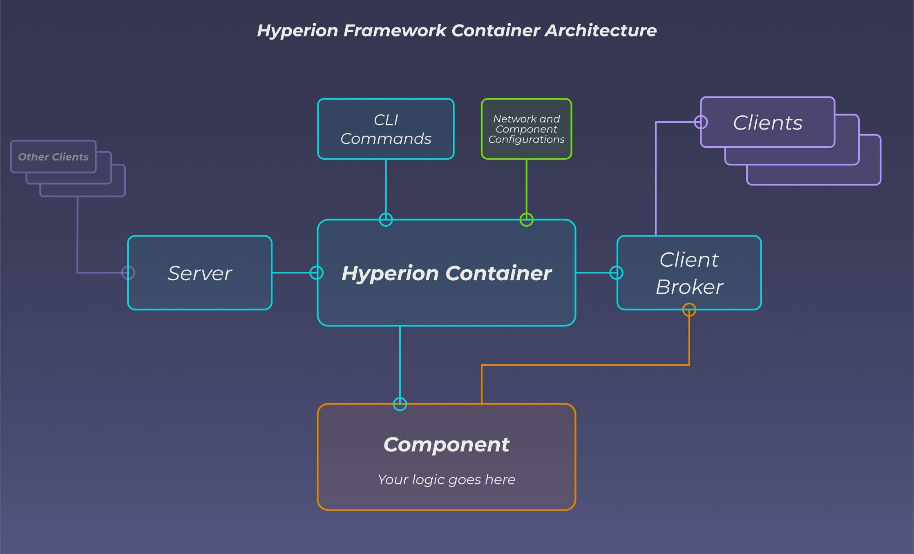

# hyperion-framework

A lightweight component-based TCP framework for building service-oriented Rust applications with CLI control, async messaging, and lifecycle management.

## Quickfire Features

- 🔌 **Component-Based Architecture**: Build modular systems with loosely coupled components
- 🌐 **TCP Communication**: Built-in networking support for distributed systems
- ⚙️ **Configuration Handling**: Built in unique config and network topology handling for each component
- 💻 **CLI Integration**: Command-line interface for system control and monitoring
- 🔄 **State Management**: Robust component state handling and lifecycle management
- 📦 **Containerisation**: Simplified component containment and management
- 🚀 **Async Support**: Built on tokio for high-performance async operations

## Hyperion Overview
Hyperion is designed around a component-based architecture, allowing you to create modular services that communicate over TCP. Each component is encapsulated in a `HyperionContainer`, which manages its lifecycle, configuration, and state.

Each component becomes a self-contained, event-driven service that:

    Listens and responds to structured TCP messages

    Exposes a CLI for control and inspection

    Handles its own config parsing, logging, and lifecycle state (start/restart/shutdown)

Hyperion is ideal for service-oriented projects where you want clean separation of logic, real-time communication, and 
container-like encapsulation within native Rust programs. 

The framework makes it simple to bring your project into a fully asynchronous and multithreaded service-based environment, enabling independent component development, easier debugging, and scalability.

Hyperion is also built on top of the Tokio async runtime, enabling high-performance, non-blocking operations.

## Architecture Overview

## Installation via [**crates.io**](https://crates.io/crates/hyperion-framework)

Add this to your `Cargo.toml`:

`hyperion-network = 0.3.2`

## [**Example Implementation**](https://github.com/Bazzz-1/hyperion-framework-examples)

## [**Documentation**](https://docs.rs/hyperion-framework)

## Project Structure

- `network/`: TCP communication and networking components
- `messages/`: Message definitions and component directives
- `utilities/`: Common utilities and helper functions
- `data_management/`: Data handling and persistence
- `containerisation/`: Component lifecycle and state management

## Dependencies

- tokio (1.44.2) - Async runtime
- serde (1.0.219) - Serialisation framework
- serde_json (1.0.140) - JSON support
- serde-xml-rs (0.8.1) - XML support
- log (0.4.27) - Logging infrastructure
- colored (3.0.0) - Terminal coloring
- async-trait (0.1.88) - Async trait support

## Contributing

Contributions are welcome! Please feel free to submit a PR with a comprehensive description of work done.

### Current TODOs
- Container heartbeats/master container state request mechanic
- Manually retry connections if the connection retry cap is reached
- Improved container startup boilerplate
- Generally improve unit and component test coverage

## License

Apache 2.0

## Test Pipeline
[hyperion-framework CI](https://github.com/yourusername/hyperion-framework/actions/workflows/ci.yml/badge.svg)