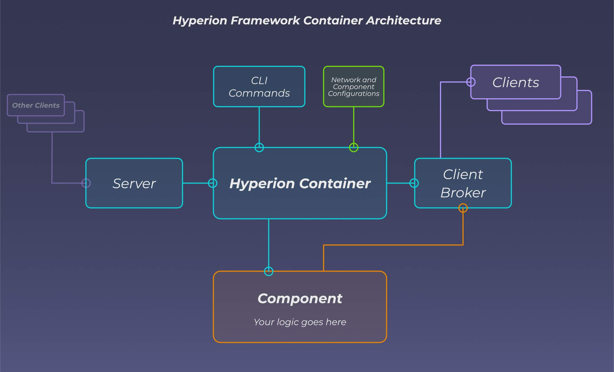

# hyperion-framework

A lightweight component-based TCP framework for building service-oriented Rust applications with CLI control, async messaging, and lifecycle management.

## Quickfire Features

- 🔌 **Component-Based Architecture**: Build modular systems with loosely coupled components
- 🌐 **TCP Communication**: Built-in networking support for distributed systems
- ⚙️ **Configuration Handling**: Built in unique config and network topology handling for each component
- 💻 **CLI Integration**: Command-line interface for system control and monitoring
- 🔄 **State Management**: Robust component state handling and lifecycle management
- 💓 **Heartbeat Monitoring**: Built-in liveness monitoring with configurable sender/receiver roles and custom handlers
- 📦 **Containerisation**: Simplified component containment and management
- 🚀 **Async Support**: Built on tokio for high-performance async operations
- 🪵 **Structured Logging**: Coloured, timestamped log output with module-level source context

## Hyperion Overview
Hyperion is designed around a component-based architecture, allowing you to create modular services that communicate over TCP. Each component is encapsulated in a `HyperionContainer`, which manages its lifecycle, configuration, and state.

Each component becomes a self-contained, event-driven service that:

    Listens and responds to structured TCP messages

    Exposes a CLI for control and inspection

    Handles its own config parsing, logging, and lifecycle state (start/restart/shutdown)

Hyperion is ideal for service-oriented projects where you want clean separation of logic, real-time communication, and 
container-like encapsulation within native Rust programs. 

The framework makes it simple to bring your project into a fully asynchronous and multithreaded service-based environment, enabling independent component development, easier debugging, and scalability.

Hyperion is also built on top of the Tokio async runtime, enabling high-performance, non-blocking operations.


## Architecture Overview



## Installation via [**crates.io**](https://crates.io/crates/hyperion-framework)

Add this to your `Cargo.toml`:

`hyperion-framework = "0.5.0"`


## [**Example Implementation**](https://github.com/robert-hannah/hyperion-framework-examples)

## [**Documentation**](https://docs.rs/hyperion-framework)


## Logging

Hyperion uses the [`log`](https://docs.rs/log) facade, so any `log`-compatible backend can be plugged in. The built-in `LoggingService` provides coloured, structured output and is initialised once at startup:

```rust
use hyperion_framework::logging::logging_service::initialise_logger;
use log::LevelFilter;

initialise_logger(LevelFilter::Debug).expect("Failed to initialise logger");
```

Each log line includes a UTC timestamp, a fixed-width coloured level badge, and the emitting module name:

```
[2026-04-24 14:32:01] INFO  hyperion_container   - Hyperion Container is running!
[2026-04-24 14:32:01] DEBUG server               - Accepted connection from 127.0.0.1:58421
[2026-04-24 14:32:01] WARN  client               - Failed to send message to DataOrchestrator
[2026-04-24 14:32:01] ERROR client_broker        - Client encountered an error: connection reset
```

Because the logger is global, any crate that depends on `hyperion-framework` and calls standard `log::info!(...)` macros will automatically produce output in the same format.


## Project Structure

- `network/`: TCP communication and networking components
- `messages/`: Message definitions and component directives
- `utilities/`: Common utilities and helper functions
- `containerisation/`: Component lifecycle and state management
- `heartbeat/`: Heartbeat sender, receiver, config, and handlers
- `logging/`: Structured log initialisation and formatting

## Heartbeat System

Hyperion has a built-in heartbeat subsystem for monitoring liveness between components. Each container can operate as a **Sender**, **Receiver**, or have heartbeats **Disabled**, configured via `configuration.xml`.

- **Sender**: periodically sends requests to named target components, tracks responses, and calls a `HeartbeatMissedHandler` for any target that doesn't respond within `response_timeout_ms`
- **Receiver**: responds to incoming requests with component health data (alive status, time since last activity, container state), and fires a `HeartbeatTimeoutHandler` if no request arrives within `timeout_ms`
- **Handlers** (`HeartbeatMissedHandler`, `HeartbeatTimeoutHandler`): user-defined callbacks, wired in at container startup. `FnHandler` / `FnMissedHandler` wrap a closure inline; `ShutdownOnTimeout` is a convenience handler that initiates a graceful shutdown when the receiver times out
- Heartbeat messages flow through the same channel as your application messages — implement `HyperionHeartbeatMessage` on your message enum and `HeartbeatConfigProvider` on your `Config` struct to opt in

See the [example repository](https://github.com/robert-hannah/hyperion-framework-examples) for a full wiring walkthrough.

## Dependencies

- async-trait (0.1.88) - Async trait support
- chrono (0.4) - UTC timestamps in log output
- colored (3.0.0) - Terminal coloring
- log (0.4.27) - Logging infrastructure
- serde (1.0.219) - Serialisation
- serde_json (1.0.142) - JSON support
- serde-xml-rs (0.8.1) - XML support
- tokio (1.47.1) - Async runtime

## Contributing

Contributions are welcome! Please feel free to submit a PR with a comprehensive description of work done.

### Current TODOs (feel free to contact for more details)
- Manually retry connections if the connection retry cap is reached
- Improved container startup boilerplate
- Component restart on failure (automatic and CLI induced)

## License

Apache 2.0

## Test Pipeline
[hyperion-framework CI](https://github.com/yourusername/hyperion-framework/actions/workflows/ci.yml/badge.svg)
